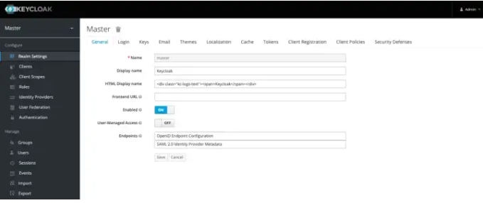
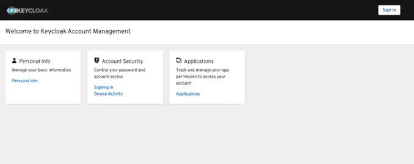
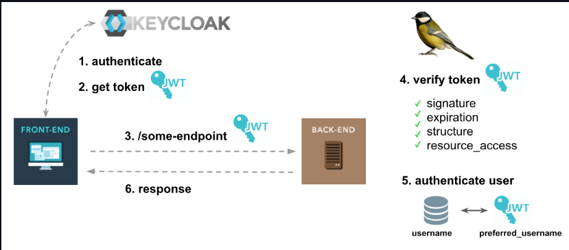

# Keycloak

## **¿Qué es Keycloak?**

[Keycloak](https://www.keycloak.org/) es un producto de software de código abierto que permite el inicio de sesión único (IdP) con Identity Management y Access Management para aplicaciones y servicios modernos.
Este software está escrito en Java y es compatible de forma predeterminada con los protocolos de federación de identidad SAML v2 y OpenID Connect (OIDC) / OAuth2.
Está bajo licencia de Apache y es compatible con Red Hat.

Desde una perspectiva conceptual, la intención de la herramienta es facilitar la protección de aplicaciones y servicios con poca o ninguna codificación.
Un IdP permite que una aplicación (a menudo llamada Service Provider o SP) delegue su autenticación.

El proyecto se inició en 2014. Desde entonces, se ha convertido en un proyecto de código abierto bien establecido con una fuerte comunidad detrás de eso.
Se utiliza para pequeños proyectos a grandes empresas.

## **Introducción a las características y capacidades de Keycloak**

Keycloak proporciona páginas de inicio de sesión totalmente personalizables, recuperación de contraseñas, aceptación de términos y mucho más. Todas estas características proporcionadas por Keycloak pueden integrar fácilmente su aplicación sin ningún tipo de codificación.

Keycloak se basa en protocolos estándar de la industria compatibles con OAuth 2.0, OpenID Connect (OAuth 2.0 + capa de autenticación) y SAML 2.0.

Keycloak utiliza su propia base de datos de usuarios. También puede integrarse con directorios de usuario existentes, como Active Directory y servidores LDAP.

Keycloak es una solución ligera y fácil de instalar. Puede escalar fácilmente a través de sus capacidades de agrupación. Tiene su propio operador k8s.

## **Ventajas que proporciona el uso de Keycloak**

- Permite que los desarrolladores se centren en la funcionalidad empresarial al no tener que preocuparse por los aspectos de seguridad de la autenticación, ya sea integrando directamente una biblioteca compatible con uno de los dos protocolos o utilizando un módulo en el servidor web o un adaptador Keycloak (lista no exhaustiva de posibilidades)
- Poder centralizar la autenticación y por lo tanto, habilitar la autenticación de inicio de sesión único (SSO)
- Poder unificar los métodos de autenticación y haga que evolucionen sin modificar las aplicaciones.
- Reinventar la autenticación de aplicaciones SaaS y controlar así la proliferación de identidades digitales; La desactivación de las cuentas se simplifica (ya no se olvida más la eliminación de una cuenta SaaS cuando un empleado se va).

## **Características principales de Keycloak**

- Inicio de sesión único
- Soporte para protocolos estándar
- Cuenta aplicaciones seguras y servicio simplificado
- LDAP compatible como repositorio de usuarios externo
- Delegación de autenticación (inicio de sesión social)
- Alto rendimiento: clúster de servidores, escalable, alta disponibilidad
- Totalmente compatible con la contenedorización
- Temas simples para implementar
- Autenticación fuerte por código nativo de un solo uso (OTP) a través de FreeOTP o Google Authenticator
- Auto-solución de problemas si olvida su contraseña
- Auto-creación de cuentas (por forma o las llamadas autenticaciones sociales)
- Extensible: base de usuarios, métodos de autenticación, protocolos.


## **Descubriendo las consolas de administración y cuentas de Keycloak**

### **Consola de administración de Keycloak**



Es para administradores y desarrolladores que desean configurar y administrar Keycloak. Para acceder, abra http://localhost:8080/auth/admin en un navegador e inicie sesión con el usuario administrador inicial creado que especificó en el paso de instalación de Docker.

Vamos a explicar la sección Configurar.

#### **Realm**
Puedes pensar en realm como un inquilino. Entonces, lo primero que querrá hacer es crear un reino para su aplicación y usuarios. Un reino está completamente aislado (en términos de configuración, usuarios, roles, etc.) de otros reinos. Debido a esto, puede crear un dominio para las aplicaciones internas y sus empleados y otro dominio para las aplicaciones externas y los clientes.

#### **Cliente**
Los clientes son entidades que pueden solicitar a Keycloak que autentique a un usuario. La mayoría de las veces, los clientes son aplicaciones web, móviles y nativas que desean usar Keycloak para protegerse y proporcionar una solución de inicio de sesión único. Los clientes también pueden ser cualquier tipo de servicios como API REST, gRPC o WebSocket que solo desean solicitar información de identidad o un token de acceso para que puedan invocar de forma segura otros servicios en la red que están protegidos por Keycloak.

#### **Ámbito del cliente**
Permite crear grupos reutilizables de notificaciones que se agregan a los tokens emitidos a un cliente. También puede definir un ámbito de cliente opcional. De este modo, debe especificar la notificación opcional con el parámetro scope.

#### ****Roles***
Normalmente representan un rol que un usuario tiene en su organización o en el contexto de su aplicación. Por ejemplo, a los usuarios se les puede conceder un rol de administrador, por lo tanto, pueden acceder y realizar cualquier acción en cualquier recurso de la aplicación. O bien, se les puede otorgar un rol de gerente de recursos humanos, por lo tanto, solo pueden acceder y realizar algunas acciones con recursos limitados. Keycloak también proporciona el concepto de roles compuestos. Pero al no usar esta función con cuidado, puede aumentar la complejidad para que su sistema sea difícil de administrar y mantener.

#### **Proveedores de identidad**
Permiten a los usuarios autenticarse en Keycloak utilizando proveedores de identidad externos o redes sociales. Keycloak tiene soporte incorporado para OpenID Connect y SAML 2.0, así como una serie de redes sociales como Google, GitHub, Facebook y Twitter, y más.

#### **Federación de usuarios**
en Keycloak, el término "federación de usuarios" se refiere a la capacidad de integración con almacenes de identidades externos. Puede pensar en LDAP como un ejemplo de un candidato para la integración a través del menú de federación de usuarios.

#### **Autenticación**
Puede pensar en la autenticación como impulsada por un conjunto de pasos secuenciales o ejecuciones que se agrupan para verificar la identidad del usuario. Puede personalizar esto seguido de copiar los flujos integrados existentes o, cambiar las prioridades de flujo tal vez eliminar un par de ellos, etc.


### Consola de cuentas de Keycloak


Es para usuarios. Pueden administrar sus cuentas actualizando su perfil y contraseña, habilitando 2FA, etc. Antes de acceder a él, puede crear un dominio y un usuario dentro de ese dominio. Cuando crea un nuevo usuario, ese usuario pertenece al dominio que está administrando. Los usuarios creados en un dominio solo pueden autenticarse a través del dominio al que pertenecen. Si puede crear un dominio denominado myrealm, puede acceder con http://localhost:8080/auth/realms/myrealm/account en un explorador.


### **OpenID Connect (OIDC)**

OpenID Connect se basa en OAuth 2.0 para agregar una capa de autenticación. En el corazón de OpenID Connect se encuentra la especificación OpenID Connect Core, cuyo objetivo es proporcionar un ecosistema completo para que ya no tenga que lidiar con la administración de usuarios y la autenticación de usuarios. Solo piense en el sitio web interminable que le permite iniciar sesión a través de su cuenta de Google. No solo debe pensar en el inicio de sesión social, puede pensar en una solución centralizada para el soporte empresarial con inicio de sesión único. También viene como autenticación más fuerte, como OTP (contraseña de un solo uso) o WebAuthn sin la necesidad de admitir directamente el código de su aplicación.


## **Instalación de Keycloak mediante Docker**

Existen varias opciones para levantar un contenedor de Keycloak con Docker dentro del Docker Hub, pero en este caso utilizaremos la imagen compartida por el usuario [jboss](https://hub.docker.com/r/jboss/keycloak) debido a que es la opción más apoyo por parte de la comunidad.
Dentro del overview del contenedor podemos ver las instrucciones para el uso y configuración de Keycloak.

Para levantar el servicio de Keycloak en el puerto 8080 de nuestro localhost, ejecutaremos el siguiente comando en nuestro terminal:

```
docker run -p 8080:8080 jboss/keycloak
```

Por defecto, la imagen de Keycloak no viene con una cuenta de administrador configurada, pero podemos hacer que sea creada una cuenta y así poder acceder al panel de administrador:

```
docker run -e KEYCLOAK_USER=<USERNAME> -e KEYCLOAK_PASSWORD=<PASSWORD> jboss/keycloak
```

Keycloak tiene soporte para las siguientes DB y lo tenemos que especificar en la variable de entorno **DB_VENDOR** de nuestro contenedor:
- h2 para base de datos embebidad H2.,
- postgres para base de datos postgresql.
- mysql para base de datos MySQL.
- mariadb para base de datos MariaDB.
- oracle para base de datos Oracle.
- mssql para base de datos Microsoft SQL Server.

Las variables de entorno necesarias para el contenedor de Keycloak son:

- DB_ADDR: Especifique el nombre de host de la base de datos (opcional). Solo para postgres, puede proporcionar una lista de nombres de host separados por comas al host alternativo de conmutación por error. El nombre de host puede ser solo host o par de host y puerto, como por ejemplo host1,host2 o host1:5421,host2:5436 o host1,host2:5000. Y keycloak agregará DB_PORT (si se especifica) a los hosts sin puerto, de lo contrario agregará el puerto predeterminado 5432, nuevamente a la dirección sin puerto solamente.

- DB_PORT: Especifique el puerto de la base de datos (opcional, el valor predeterminado es el puerto predeterminado del proveedor de base de datos).

- DB_DATABASE: Especifique el nombre de la base de datos que se va a utilizar (opcional, el valor predeterminado es keycloak).

- DB_SCHEMA: Especifique el nombre del esquema que se usará para la base de datos que admite esquemas (opcional, el valor predeterminado es público en Postgres).

- DB_USER: especifique el usuario que se usará para autenticarse en la base de datos (opcional, el valor predeterminado es '').

- DB_USER_FILE: especifique el usuario para autenticarse en la base de datos mediante la entrada de archivos (alternativa a DB_USER).

- DB_PASSWORD: especifique la contraseña del usuario que se usará para autenticarse en la base de datos (opcional, el valor predeterminado es '').

- DB_PASSWORD_FILE: especifique la contraseña del usuario que se utilizará para autenticarse en la base de datos mediante la entrada de archivos (alternativa a DB_PASSWORD).

## **Docker Compose**

En este [archivo](docker-compose.yml) podemos encontrar un entorno de trabajo web con PHP/PostgreSQL/Keycloak listo para utilizarse.


## **Simple Keycloak Guard for Laravel / Lumen**

Si lo que se desea es el desarrollo de API's de Laravel y utilizar Keycloak Server para delegar el trabajo de autenticación de autenticación de nuestro sistema, se recomienda utilizar [Simple Keycloak Guard for Laravel / Lumen](https://github.com/robsontenorio/laravel-keycloak-guard), el cual es un paquete que te ayudará a realizar la autenticación de tus usuarios mediante Keycloak Server haciendo uso de JWT.

### **Requerimientos para su uso**
✔️ Estoy construyendo una API con Laravel.

✔️ No usaré Laravel Passport para la autenticación, porque Keycloak Server hará el trabajo.

✔️ El frontend es un proyecto separado.

✔️ Los usuarios frontend se autentican directamente en Keycloak Server para obtener un token JWT. Este proceso no tiene nada que ver con la API de Laravel.

✔️ El frontend mantiene el token JWT de Keycloak Server.

✔️ El frontend realiza solicitudes a la API de Laravel, con ese token.

